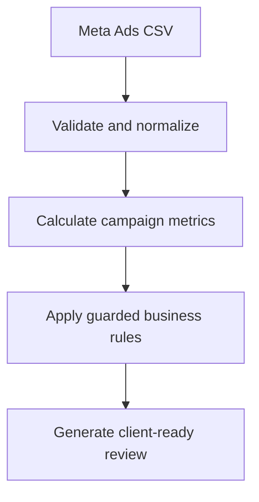
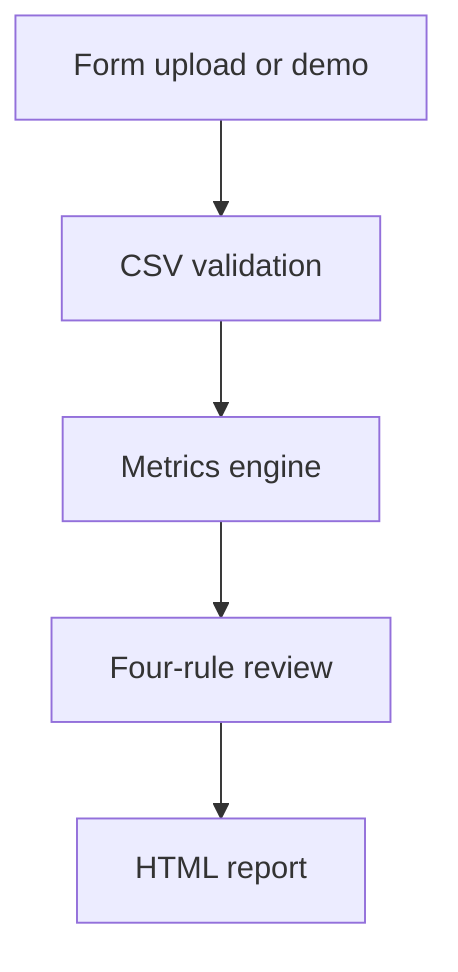

<div align="center">


# AccountPulse

### Explainable Paid Media Growth Reviewer

**Turn Meta Ads data into evidence-based insights and a client-ready growth plan.**

[](https://n8n.io/)


</div>

---

## What it does

AccountPulse is an n8n-based decision-support workflow for paid-media account reviews. It accepts a Meta Ads CSV export, validates and normalizes the data, calculates campaign KPIs, detects risks and growth opportunities using guarded business rules, and produces a client-ready HTML report.

| Input | Decision engine | Output |
|---|---|---|
| Meta Ads CSV + budget context | 7 deterministic KPIs + 4 explainable rules | Risks, opportunities, evidence and action plan |
| Built-in purpose-designed demo | Minimum-volume safeguards | Printable client-ready HTML report |

> **Key design principle:** AI may explain verified findings, but it never calculates metrics, fires rules or invents causes.

## Why I built it

Paid-media reviews often require the same repetitive work: cleaning exports, recalculating KPIs, checking whether changes are sufficiently supported by the available data, identifying risks, and translating the findings into client-friendly recommendations.

Sending a raw CSV directly to an LLM can produce fluent summaries, but it does not guarantee consistent calculations, evidence traceability or sensible handling of low-volume data. AccountPulse separates those responsibilities:



## Report experience

The generated report is designed for both performance marketers and client-facing account teams:

- **Performance Snapshot** — spend, projected month-end spend, budget, CTR, CPA and ROAS
- **Executive Summary** — concise account-level interpretation
- **Campaign Performance** — campaign-by-campaign KPI comparison
- **Triggered Alerts & Evidence** — exact values and thresholds behind every finding
- **Recommended Action Plan** — prioritized, evidence-bound next steps
- **Insufficient Data Notices** — clear guardrails instead of unreliable conclusions
- **Methodology & Limitations** — transparent formulas, rules and constraints

## Explainable rule engine

| Rule | Trigger | Guardrail | Example action |
|---|---|---|---|
| **Budget Pacing** | Projected spend is below 90% or above 110% of budget | At least 7 calendar days with adequate date coverage | Review pacing and reallocate budget where justified |
| **CPA Deterioration** | Recent 7-day CPA is at least 20% above the previous 7-day CPA | At least 15 conversions in each comparison window | Review audience quality, bids, offer and landing-page factors |
| **Creative Deterioration** | CTR falls at least 15% while CPC rises at least 20% | At least 5,000 impressions and 50 clicks in each window | Refresh creatives and verify frequency and audience response |
| **Controlled Scaling** | CPA is at least 15% below target and deterioration is no more than 10% | At least 15 recent conversions and no clear overspend | Test a measured 10–20% budget increase with close monitoring |

AccountPulse uses **“creative performance deterioration”** rather than claiming “creative fatigue.” Falling CTR and rising CPC are performance signals—not proof of a single cause.

## Quick start

> New to n8n? Follow the complete **[Step-by-step setup and test guide](./STEP_BY_STEP.md)**.

### Option A — Run the 60-second demo

1. Download [`AccountPulse_MVP_GitHub_Public.json`](./AccountPulse_MVP_GitHub_Public.json).
2. In n8n, select **Import from File** and choose the JSON file.
3. Open **Run AccountPulse Demo**.
4. Select **Execute Workflow**.
5. Open the generated AccountPulse HTML report.

The demo data is deliberately engineered to show budget pacing, CPA deterioration, creative deterioration, a scaling opportunity and an insufficient-data case in one run.

### Option B — Upload a CSV

1. Publish the imported workflow in n8n.
2. Open the production form URL from **Upload Meta Ads CSV**.
3. Upload a compatible CSV and enter:
   - Monthly budget
   - Target CPA
   - Currency
   - Analysis date
4. Submit the form to generate the report.

You can test the upload path with [`AccountPulse_Meta_Ads_Test.csv`](./AccountPulse_Meta_Ads_Test.csv).

## Documentation

- **[Step-by-step setup and test guide](./STEP_BY_STEP.md)** — import, demo run, CSV upload, verification and troubleshooting
- **[Sample Meta Ads CSV](./AccountPulse_Meta_Ads_Test.csv)** — purpose-built data that demonstrates all four rule states
- **[Public n8n workflow](./AccountPulse_MVP_GitHub_Public.json)** — credential-free workflow ready to import

## CSV schema

### Required columns

```text
date
campaign_name
spend
impressions
clicks
conversions
```

### Optional columns

```text
revenue
ad_name
```

The ingestion layer also handles common English Meta Ads aliases, currency symbols, thousands separators, percentage signs, blank rows and summary rows. Missing or malformed fields return a clear validation message.

## Metrics and forecasting

All figures are calculated in JavaScript Code nodes with zero-safe division:

- Spend
- CTR
- CPC
- Conversion rate
- CPA
- ROAS
- Projected month-end spend

The MVP uses a transparent linear pacing model:

```text
Projected Month-End Spend =
Month-to-Date Spend / Elapsed Calendar Days × Total Calendar Days in Month
```

This model does not account for day-of-week patterns, seasonality, scheduled budget changes or promotional events. If date coverage is inadequate, AccountPulse returns **Insufficient Data for Reliable Forecast** instead of a false-precision estimate.

## Why rules instead of machine learning?

For a client-facing MVP, guarded rules are more useful than an opaque model:

- **Reproducible** — identical inputs produce identical results
- **Auditable** — every alert shows its threshold and exact evidence
- **Data-efficient** — no training dataset is required
- **Safer** — low-volume campaigns do not trigger misleading conclusions
- **Client-ready** — recommendations can be explained and challenged

Machine learning may be useful later for richer forecasting or anomaly detection, but only after reliable historical data and evaluation criteria are available.

## AI boundary

| AI may | AI may not |
|---|---|
| Rewrite verified findings in clearer client language | Calculate or alter campaign metrics |
| Adjust tone and structure | Decide whether a rule fires |
| Produce meeting talking points from structured evidence | Invent causes, evidence or expected outcomes |

The optional AI narrative node is disabled in the public MVP. The full workflow works without an OpenAI credential.

## Reliability and safety

- Handles zero impressions, clicks and conversions without `NaN` or `Infinity`
- Validates empty files, missing columns, invalid dates and malformed numbers
- Requires minimum conversion, impression and click volumes before drawing conclusions
- Produces identical normalized schemas for demo and upload paths
- Never connects to or modifies live Meta Ads campaigns
- Requires human approval before any budget change
- Contains no credentials, private URLs or execution history

## Workflow architecture



<details>
<summary><strong>Core n8n nodes</strong></summary>

1. **Upload Meta Ads CSV** / **Run AccountPulse Demo**
2. **Extract CSV to JSON**
3. **Normalize and Validate CSV**
4. **Calculate Campaign Metrics**
5. **Rule 1–4**
6. **Build AccountPulse Report**
7. **Optional AI Narrative — Phase 2** *(disabled)*
8. **Display Analysis Report**

</details>

## What this project demonstrates

AccountPulse was built as a portfolio project for roles at the intersection of:

- Performance marketing and campaign optimization
- Account strategy and client communication
- Marketing operations and workflow automation
- Data-informed commercial decision-making
- Responsible AI and explainable automation

It complements my production automation work by showing not only **how to automate a process**, but also **how to turn marketing data into an auditable business recommendation**.

## Roadmap

- [x] CSV validation and normalization
- [x] Deterministic KPI engine
- [x] Four explainable rules with minimum-data guardrails
- [x] Client-ready HTML report
- [x] Built-in end-to-end demo
- [ ] Optional evidence-bound AI narrative
- [ ] Printable report layout and export polish
- [ ] Historical trend and day-of-week pacing model
- [ ] Additional paid-media platform templates

## Portfolio

This is one of three projects in my marketing, automation and growth portfolio.

**Explore the full portfolio:** [github.com/brendanfok886-ctrl](https://github.com/brendanfok886-ctrl)

---

<div align="center">

Built by **Brendan Fok**  
[LinkedIn](https://www.linkedin.com/in/wang-hei-fok-0a9557358) · [GitHub](https://github.com/brendanfok886-ctrl)

</div>
